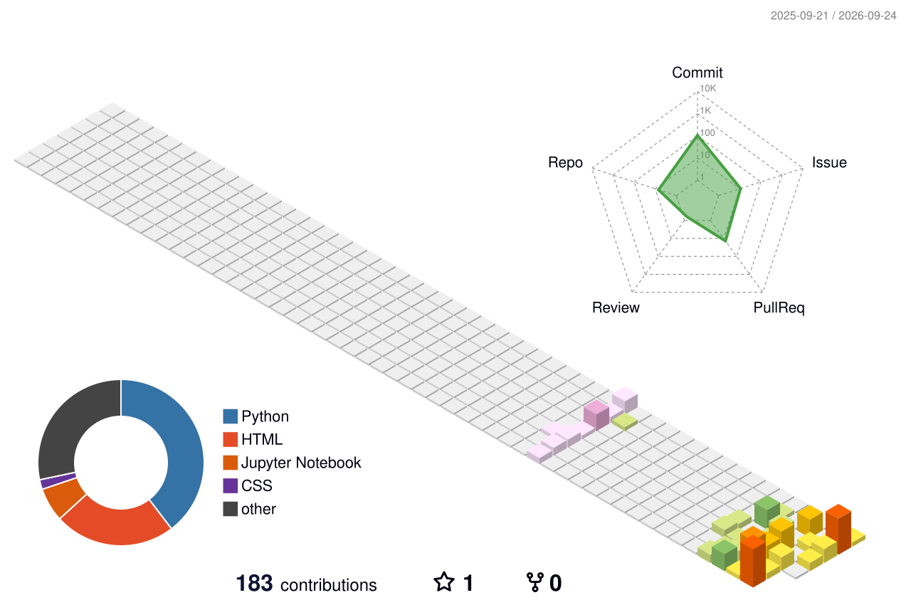

<div align="center">

<a href="https://github.com/sajadhatami">
  
</a>

<br>


<br><br>

<a href="https://github.com/sajadhatami">
  
</a>
&nbsp;
<a href="https://www.linkedin.com/in/sajadhatami">
  
</a>

</div>

---

## 👨‍💻 About Me

I'm a **Python backend developer** focused on building APIs and backend systems.

My current focus is on:

- 🐍 Python
- ⚡ FastAPI
- 🌐 Django & Django REST Framework
- 🐘 PostgreSQL
- 🔐 Authentication & Authorization
- 🧪 Automated Testing
- 🐳 Docker
- 🏗️ Backend Architecture

I enjoy understanding systems from the HTTP request all the way down to the database transaction and back to the API response.

---

## 🧰 Tech Stack

<div align="center">

### Backend


### Tools & Infrastructure


</div>

<br>

<div align="center">

`REST APIs` · `Async Python` · `SQLAlchemy` · `Alembic` · `JWT` · `Clean Architecture` · `Repository Pattern` · `Unit of Work`

</div>

---

## 🚀 Featured Projects

<table>
<tr>

<td width="50%" valign="top">

### ⚡ FastAPI Todo API

Asynchronous REST API built with FastAPI and PostgreSQL, focused on authentication, ownership and clean backend architecture.

**Stack**

- Python 3.13
- FastAPI
- PostgreSQL
- SQLAlchemy 2
- Alembic
- JWT & Argon2
- Docker Compose
- Pytest

**Architecture**

`Router → Service → Repository → Database`

<br>

<a href="https://github.com/sajadhatami/fastapi-todo-app"> 
   
</a> 

</td> 

<td width="50%" valign="top">

### 🍳 DRF Recipe API

Django REST Framework API focused on REST design, validation, authentication and structured backend development.

**Stack**

- Python
- Django
- Django REST Framework
- PostgreSQL
- Serializers
- Authentication
- Validation

**Focus**

`API Design → Validation → Business Logic`

<br>

<a href="https://github.com/sajadhatami/drf-recipe-api"> 
   
</a> 

</td> 
</tr> 

<tr> 
<td width="50%" valign="top">

### 📝 Portfolio Blog

Web application focused on backend development, content management and building a structured application around real-world use cases.

**Focus**

- Python Backend
- Web Application
- Content Management
- Database Design
- Authentication
- API Development

**Architecture**

`Request → Application → Database`

<br>

<a href="https://github.com/sajadhatami/portfolio-blog"> 
   
</a> 

</td> 

<td width="50%" valign="top">

### 🧠 Raviku

Smart content ingestion backend currently under active development, exploring source discovery, content processing and AI-assisted workflows.

**Focus**

- FastAPI
- PostgreSQL
- Authentication
- Source Processing
- Content Ingestion
- AI Integration

**Architecture**

`Source → Processing → Storage → API`

<br>

<a href="https://github.com/sajadhatami"> 
   
</a> 

</td> 
</tr> 
</table>

---

## 🏗️ Backend Architecture

<div align="center">


</div>

<br>

<div align="center">

| Layer | Responsibility |
| :---: | :--- |
| 🌐 Router | HTTP / Request / Response |
| ⚙️ Service | Business Logic |
| 🗄️ Repository | Data Access |
| 🔄 Unit of Work | Transaction Management |
| 🐘 PostgreSQL | Persistent Storage |

</div>

---

## 📊 GitHub Activity

<div align="center">


---

## 🐍 Contribution Flow

<div align="center">
  <picture>
    <source media="(prefers-color-scheme: dark)" srcset="https://raw.githubusercontent.com/sajadhatami/sajadhatami/output/github-snake-dark.svg" />
    <source media="(prefers-color-scheme: light)" srcset="https://raw.githubusercontent.com/sajadhatami/sajadhatami/output/github-snake.svg" />
    
  </picture>
</div>

---

## 🧊 3D Contribution Graph

<div align="center">



</div>

---

## ⚡ Engineering Principles

<div align="center">

```text
Understand the system
        ↓
Design the boundary
        ↓
Keep responsibilities separated
        ↓
Make failures explicit
        ↓
Test important behavior
        ↓
       Ship
```

## 📫 Connect

<div align="center">

<a href="https://github.com/sajadhatami">
  
</a>
&nbsp;
<a href="https://www.linkedin.com/in/sajadhatami">
  
</a>

<br><br>

<sub>Built with Markdown, SVGs and GitHub Actions.</sub>

</div>
